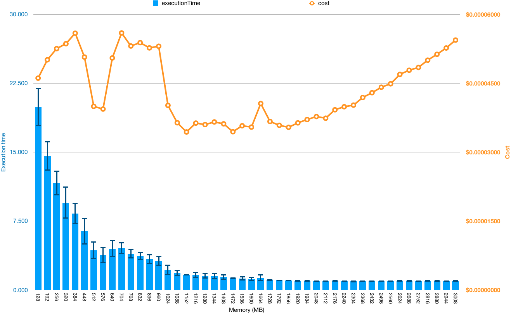

# Cost estimates

Get a cost estimate for your workload:

```typescript
const costSnapshot = await faastModule.costSnapshot();
    console.log(costSnapshot);
}
```

Example cost estimate output:

```text
functionCallDuration  $0.00002813/second            0.6 second     $0.00001688    68.4%  [1]
sqs                   $0.00000040/request             9 requests   $0.00000360    14.6%  [2]
sns                   $0.00000050/request             5 requests   $0.00000250    10.1%  [3]
functionCallRequests  $0.00000020/request             5 requests   $0.00000100     4.1%  [4]
outboundDataTransfer  $0.09000000/GB         0.00000769 GB         $0.00000069     2.8%  [5]
logIngestion          $0.50000000/GB                  0 GB         $0              0.0%  [6]
---------------------------------------------------------------------------------------
                                                                   $0.00002467 (USD)

  * Estimated using highest pricing tier for each service. Limitations apply.
 ** Does not account for free tier.
[1]: https://aws.amazon.com/lambda/pricing (rate = 0.00001667/(GB*second) * 1.6875 GB = 0.00002813/second)
[2]: https://aws.amazon.com/sqs/pricing
[3]: https://aws.amazon.com/sns/pricing
[4]: https://aws.amazon.com/lambda/pricing
[5]: https://aws.amazon.com/ec2/pricing/on-demand/#Data_Transfer
[6]: https://aws.amazon.com/cloudwatch/pricing/ - Log ingestion costs not currently included.
```

Learn more about [cost snapshots](./api/faastjs.costsnapshot.md).

## CSV output

Get the cost estimate out as CSV string, which can be read into a spreadsheet for further analysis:

```typescript
costSnapshot.csv();
```

## Cost analyzer

How much memory should you allocate to your function? More memory means a higher price per unit time, but also faster CPU. Cost analyzer helps answer this question by running your workload against multiple configurations, such as differing memory sizes:

```typescript
costAnalyzer(mod, "./functions", { work });
```

Cost analyzer output:

```text
  ✔ aws 128MB queue 15.385s 0.274σ $0.00003921
  ✔ aws 192MB queue 10.024s 0.230σ $0.00003576
  ✔ aws 256MB queue 8.077s 0.204σ $0.00003779
     ▲    ▲     ▲     ▲       ▲        ▲
     │    │     │     │       │        │
 provider │    mode   │     stdev     average
          │           │   execution  estimated
        memory        │     time       cost
         size         │
                execution time
```

Here's a chart showing the execution time and cost of generating 100M random numbers at every memory size on AWS Lambda. The conclusion? You should probably pick a memory size around 1728MB-2048MB to get the most performance at a low cost if your workload is CPU bound. But your results may vary depending on the particulars of your workload. Do your own experiments to verify against your workload.



## Limitations

Cost estimates are estimates. They do not capture all costs, and you should not rely solely on faast.js cost estimates. Known limitations include:

-   The estimates do not take into account the cost of services consumed inside your code. For example, if you make non-free API calls from within your faast module, these costs are not captured because faast.js does not know about them.

-   The estimates do not take into account log ingestion costs.

-   The estimates do not take into account free tiers.

-   The estimates assume worst-case tier pricing. If your cloud usage is extensive you may qualify for lower priced tiers (however AWS Lambda and Google Cloud Functions currently do not have tiered pricing, and usually account for most of the cost of faast.js workloads).

-   Ongoing storage costs such as S3 storage are not counted because they are ongoing and not ephemeral.

On the other hand, there are many situations where you won't incur extra costs (or can even exclude some costs assumed by faast.js):

-   S3 data transfer from within the same region as your Lambda functions are free.

-   If you run faast.js from an EC2 server within the same region as your Lambda functions, you can disregard the outbound data transfer costs.
