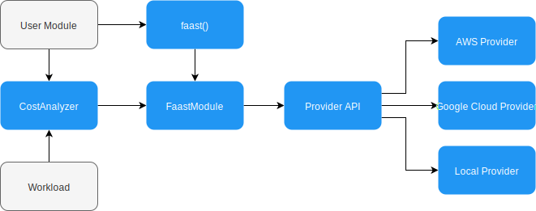

# faast.js architecture

The core of faast.js is the [`FaastModuleProxy`](./api/faastjs.faastmoduleproxy.md) class, which implements the [`FaastModule`](./api/faastjs.faastmodule.md) interface. This proxy class contains the local proxy functions and invokes the provider implementation to perform provider-specific work. In addition, `FaastModuleProxy` contains the faast.js "runtime" which includes managing throttling and queues for outstanding invocations, statistics tracking, and acting as the controller by invoking the Provider API.

The Provider API is the interface between `FaastModuleProxy` and provider-specific implementations:

Each provider implements the interface in [provider.ts](../src/provider.ts).

## Cost Analyzer

The cost analyzer takes a [`Workload`](./api/faastjs.costanalyzer.workload.md) as input in addition to the User Module. The workload invokes the cloud functions, and is required because the Cost Analyzer creates multiple faast.js instances, one for each configuration.

## Implementing Providers

Review the implementation for the [AWS](../src/aws/aws-faast.ts) to understand the Provider API.
