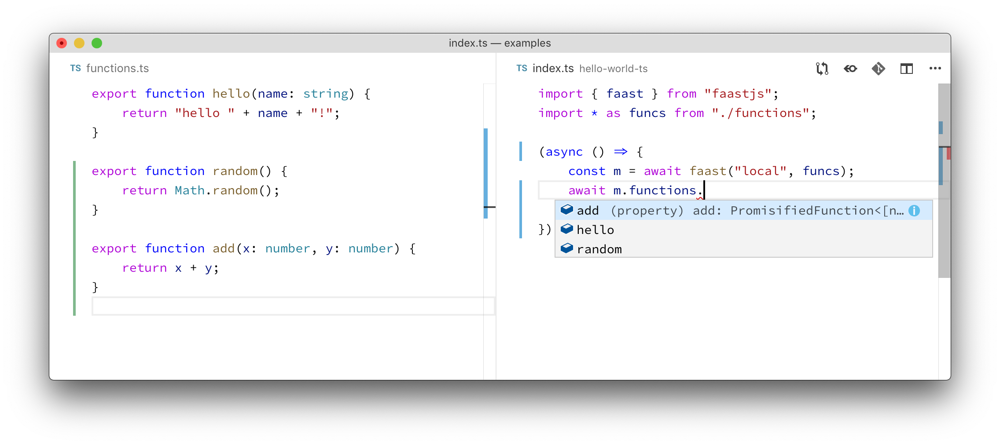

**What if serverless functions were as easy to use as regular functions?**

There would be no infrastructure to create, no command lines to run. Invoke them, and they would run. Finish with them, and they would go away. They would work with all of the nice things in your IDE, and be programmable with the powerful tools and libraries you already use.

So powerful, you could summon a thousand cores to get large jobs done in a snap. So convenient, it would start to feel limiting not to use them. _It would make you think differently about how to write code._

That's what faast.js is designed to do.

<!--truncate-->

Faast.js started as a side project to solve the problem of large scale software testing. Serverless functions seemed like a good fit because they could scale up to perform work in parallel, then scale down to eliminate costs when not being used. Even better, all infrastructure would be managed by the cloud provider. It seemed like a dream come true: a giant computer that could be as big as needed for the job at hand, yet could be rented in 100ms increments.

But trying to build this on AWS Lambda was challenging:

-   **Complex setup.** Lambda throws you into the deep end with IAM roles, permissions, command line tools, web consoles, and special calling conventions. Lambda and other FaaS are oriented towards an event-based processing model, and not optimized for batch processing.

-   **Primitive package dependency support.** Everything has to be packaged up manually in a zip file. Every change to the code or tests requires a manual re-deploy.

-   **Native packages.** Common testing tools like puppeteer are supported only if they are compiled specially for Lambda.

-   **Persistent infrastructure.** Logs, queues, and functions are left behind in the cloud after a job is complete. These incur costs and count towards service limits, so they need to be managed or removed, creating an unnecessary ops burden.

-   **Developer productivity.** Debugging, high quality editor support, and other basic productivity tools are awkward or missing from serverless function development tooling.

Faast.js was born to solve these and many other practical problems, to make serverless batch processing as simple as possible while preserving their power.

## Design principles for faast.js

### Deep interfaces

Faast.js presents a ["deep" interface](https://web.stanford.edu/~ouster/cgi-bin/cs190-winter18/lecture.php?topic=modularDesign). The main interface to faast.js is a single function, `faast()`:

```typescript
faast("aws", funcs);
```

The only additional thing required is a cloud provider account. That's it.

Each exported function in `funcs` is automatically available for invocation as a serverless function:



On the left is an ordinary JavaScript module. On the right is the code that invokes these functions in a serverless function. As the developer types `m.functions.`, autocomplete pops up all of the exports from the module. Instant feedback on code changes across the serverless function call boundary makes developing with faast.js exceptionally efficient.

### Ephemeral infrastructure

When `faast()` is invoked, it starts creating the infrastructure it needs:


The exact infrastructure created depends on the cloud provider and the options you provide. But the beautiful thing is **users of faast.js don't need to manage any of this infrastructure**. You don't even need to run a command to initialize it. Faast.js will automatically create new infrastructure for you on the fly, so there is no "deploy" step with faast.js; every time you invoke `faast()`, code is bundled and infrastructure is deployed.

The benefits of ephemeral infrastructure are many. New faast.js instances will start with a clean slate, without contamination of global variables or local filesystems with data leaked from prior function invocations. New code versions are deployed immediately, reducing the friction of rapid iteration. And multiple instances of the same workflow can be started at the same time without interference.

From a security standpoint, infrastructure that isn't there very long is harder to exploit. Like all serverless platforms, infrastructure patching is handled by the cloud provider. But faast.js goes further because code is re-bundled every time it's deployed. Just keep local package dependencies up to date and you're automatically keeping infrastructure patched. No need to worry about migration and upgrade of long-running services.

When your job is done, call a single cleanup function to remove all the infrastructure that faast.js created. There's even a garbage collector to clean up infrastructure remnants left over from crashes and incomplete cleanup.

Creating and destroying infrastructure repeatedly might seem to be wasteful or slow. But cloud providers have been working for years on making these infrastructure operations faster, and on AWS the infrastructure needed to create a cloud function from scratch can take as little as 2 seconds.

## As easy as serverless batch gets

That's the basics. Check out more in the [documentation](https://faastjs.org/docs/introduction).

You are now free to invoke code in the cloud at any scale you wish, with no hassles. Try it out!

## Use cases

Here are a few ideas to get you started.

-   **Test at scale.** Run hundreds tests in parallel. Run _thousands_ of tests in parallel. Run [headless chrome](https://github.com/GoogleChrome/puppeteer) and grab screenshots of web pages a thousand at a time.

-   **Generate load.** Don't bother setting up a complex load testing environment. Mix request logic, stir with faast.js, and you've got instant load testing infrastructure. Imagine load testing every commit, or even have developers load test _before_ they commit.

-   **Process documents and data.** Scatter 1TB of data from S3 to Lambda functions in under 40 seconds _for free_. Run transformations, analysis, ETL, and other workloads faster, and do it with no operational overhead, just pure code.

-   **Process images.** Make light work of resizing boatloads of images. [Sharp](https://github.com/lovell/sharp) and other native image processing libraries can be used with minimal hassle with faast.js.

This is just the tip of the iceberg. I'm excited to see what you'll build with faast.js!

If you'd like to discuss faast.js ideas or issues, join our [slack channel](https://join.slack.com/t/faastjs/shared_invite/enQtNTk0NTczMzI4NzQxLTA2MWU1NDA1ZjBkOTc3MTNkOGMzMDY0OWU1NGQ5MzM2NDY1YTJiZmNmODk4NzI0OWI1MzZhZDdiOTIzODNkOGY). Also check out our [website](https://faastjs.org), [docs](https://faastjs.org/docs/introduction), and [github repository](https://github.com/faastjs/faast.js).

## Up next

In my next blog post, I'll cover how faast.js helps understand and optimize cloud costs.
